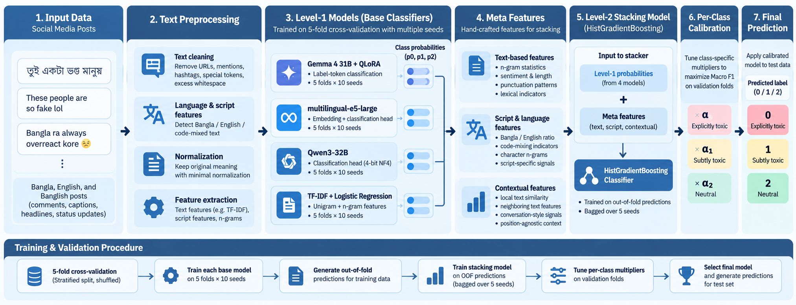
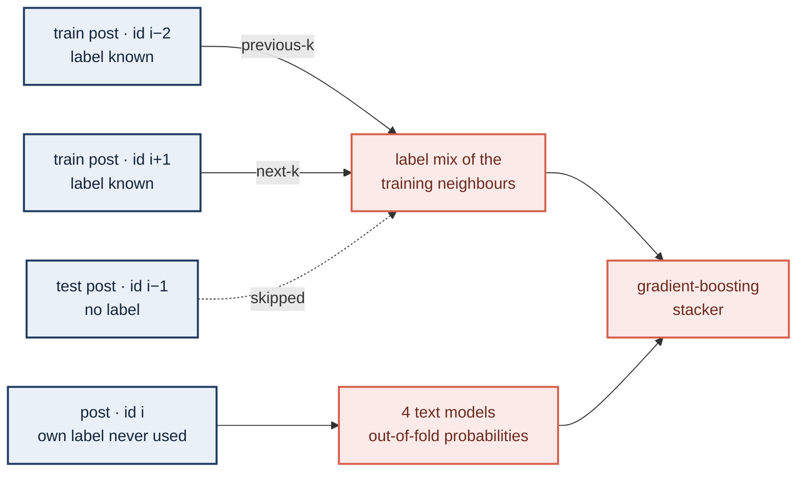
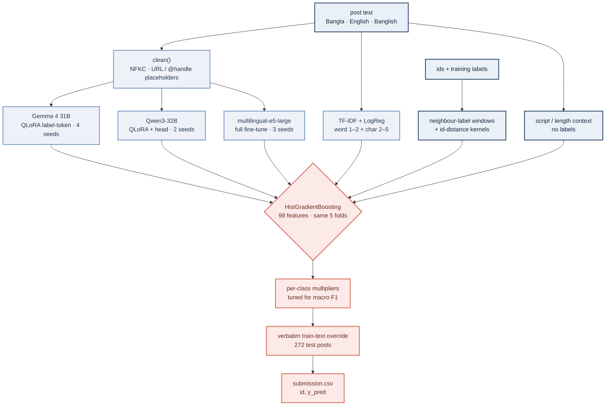

<div align="center">

# Team IUT BakeNekos — 1st Runners-up Solution

### Explicit and subtle harmful-content detection in Bangla, English and Banglish social media

**"Real talent thakle eto marketing lagto na"** — *a Banglish training post, labelled neutral; deciding whether it is sarcasm is the whole task*

**1st Runners-up — HerWILL × UAP Safe Social Media Datathon 2026 on Kaggle**

[](#4-leaderboard-journey)
[](#4-leaderboard-journey)
[](#2-the-finding-that-decided-the-competition)
[](https://huggingface.co/google/gemma-4-31B)
[](https://huggingface.co/Qwen/Qwen3-32B)
[](https://huggingface.co/intfloat/multilingual-e5-large)
[](#8-reproducing-the-results)

**Md. Farhan Ishraq**¹ · **Didhiti Nahid**¹ · **Tamim Muhammad Rayeed**² 

<sub>¹ Islamic University of Technology &nbsp;·&nbsp; ² University of Dhaka<br>
Kaggle community competition <a href="https://www.kaggle.com/competitions/
 · 27–28 September 2026 · 25 hours from brief to deadline</sub>

<br>



<sub>The whole system on one page — from the <a href="report/IUT_BakeNekos_HerWILL2026_Research_Report.pdf">research report</a></sub>

</div>

---

> Given a social-media post in **Bangla, English or Banglish**, decide whether it is explicitly
> toxic, subtly toxic (sarcasm, coded language) or neutral — scored on **macro F1**, with
> **no external data** and about **24 hours** on the clock.
>
> The competition was not decided by a bigger language model. Fine-tuned text models
> plateaued near **0.63** however they were combined. It was decided by reading how the
> dataset was built — the `id` column is the order in which the posts were **collected**, and
> posts adjacent in it share a label **61.5%** of the time against **40.6%** by chance — and by
> refusing to trust the public leaderboard. Leakage-safe neighbour-label features lifted macro F1
> by **+0.12**, more than the whole distance from TF-IDF to Gemma 4 31B, and cross-validation
> predicted the private score to within **0.0003**.

<table>
<tr>
<td width="25%" align="center"><h3>0.75543</h3>private leaderboard, selected submission — <b>2nd</b>, up from 3rd on the public board</td>
<td width="25%" align="center"><h3>0.76000</h3>best private score of any of our submissions: stack v10, the one this package rebuilds</td>
<td width="25%" align="center"><h3>0.0003</h3>gap between cross-validation and the private score of the selected stack</td>
<td width="25%" align="center"><h3>11,955/11,955</h3>test rows reproduced byte for byte by the main notebook, on a CPU, in minutes</td>
</tr>
</table>

| | |
|---|---|
| **Outcome** | 2nd on the private leaderboard (0.75543) with the selected v9 stack; the unselected v10 stack scored 0.76000 |
| **Final system** | Two-level stack: **Gemma 4 31B** QLoRA ×4 seeds + **Qwen3-32B** QLoRA ×2 + **multilingual-e5-large** ×3 + **TF-IDF** → HistGradientBoosting over **98** leakage-safe features → per-class calibration for macro F1 |
| **Reproducibility** | The main notebook regenerates the v10 CSV byte for byte (sha256 `aa8a5180b35268eb…63d86f91`) with scikit-learn 1.9.1 |
| **Write-ups** | [Research report](report/IUT_BakeNekos_HerWILL2026_Research_Report.pdf) (24 pp.) · [IEEE-format paper](report/IUT_BakeNekos_IEEE_Paper.pdf) · [Presentation](report/IUT_BakeNekos_Presentation.pdf) |

---

## Contents

**The argument**
&nbsp;&nbsp;[1. The task](#1-the-task) ·
[2. The finding that decided the competition](#2-the-finding-that-decided-the-competition) ·
[3. The final system](#3-the-final-system)

**The evidence**
&nbsp;&nbsp;[4. Leaderboard journey](#4-leaderboard-journey) ·
[5. What worked, and what we closed by measurement](#5-what-worked-and-what-we-closed-by-measurement)

**The code**
&nbsp;&nbsp;[6. Repository layout](#6-repository-layout) ·
[7. Where to read what](#7-where-to-read-what) ·
[8. Reproducing the results](#8-reproducing-the-results) ·
[9. Data, models and licences](#9-data-models-and-licences) ·
[10. Kaggle artifacts](#10-kaggle-artifacts) ·
[11. Hard-won lessons](#11-hard-won-lessons) ·
[12. Old path → repo path](#12-old-path--repo-path)

---

## 1. The task

| | |
|---|---|
| Input → output | one social-media post → `0` explicitly toxic or hateful · `1` subtly toxic (sarcasm, coded language) · `2` non-toxic / neutral |
| Data | `train.csv` 47,817 rows (`id,text,y`) · `test.csv` 11,955 rows (`id,text`) · `sample_submission.csv` |
| Submission | `id,y_pred`, one row per test id |
| Metric | **macro F1**: the unweighted mean of the three per-class F1 scores |
| Leaderboard | public = 40% of test (≈4,800 posts), shown live · private = the hidden 60%, decides the ranking · two submissions selected |
| Hard rules | **provided data only** — no external datasets · deadline 28 Sep 2026 12:00 UTC, about 24 hours after the brief |

**Early measurements that shaped everything** ([report](report/IUT_BakeNekos_HerWILL2026_Research_Report.pdf) §2):

- The neutral class is only **12.3%** of training rows (explicit 49.7%, subtle 38.0%) but carries a full third of macro F1, so the decision rule had to be tuned for it.
- Posts are short (median **8 words**). Emojis, repeated punctuation and capitals carry much of the sarcasm behind class 1, so preprocessing keeps them.
- 42.2% of posts contain Bangla script, and the label mix depends on script: Bangla-script posts are 59.2% explicit and 7.2% neutral, against 42.8% and 16.1% for English and Banglish.
- Labels are noisy. Near-identical training twins (cosine ≥ 0.99) share a label only **84%** of the time, so macro F1 far above 0.8 is implausible. That ceiling later exposed a leak (§11).
- A TF-IDF baseline (OOF 0.5219, public 0.54091) was submitted **19 minutes** after the brief was read, on the same pinned folds every later model used.

## 2. The finding that decided the competition

**The collection order (27 Sep, 16:40 UTC).** The `id` column is contiguous from 0 to 59,771 across train *and* test, and the test posts sit at random positions inside it. Script and class mix both drift in long, smooth stretches along it: ids 0–6,000 are 97% Bangla, ids 18,000–24,000 almost entirely English. Training posts adjacent in id order share a label **61.5%** of the time, against **40.6%** if labels were independent, and the excess decays smoothly with distance (0.555 at 10 rows, 0.505 at 100). A 5-nearest-neighbour vote over the id alone, reading no text at all, scored **0.600** OOF — as much as the best text model we had at that moment.



That turns the task from text classification alone into **text + context**: what the post says, and what the posts collected around it were labelled.

| prediction source | OOF macro F1 | held-out | public LB | private LB |
|---|---|---|---|---|
| TF-IDF + logistic regression *(raw argmax, as submitted)* | 0.5219 | — | 0.54091 | 0.53484 |
| best single text model: Gemma 4 31B, 4 seeds | 0.636 | — | — | — |
| text-only blend of every level-1 model | 0.6307 | 0.6373 | — | — |
| id features only, no text | 0.6650 | 0.6656 | — | — |
| **stack v9, 5-seed bag (selected)** | **0.7551** | **0.7547** | 0.74088 | **0.75543** |
| **stack v10, + id-distance kernels** | **0.7620** | **0.7625** | 0.73957 | **0.76000** |

OOF scores are after per-class calibration unless marked. Held-out fits the calibration on folds 0–2 and scores folds 3–4.

**Within the rules, and reported honestly.** The rules forbid external data; the id features use only the provided files. Every window obeys explicit leakage rules (§3), and a training post never sees its own label. The signal reflects how the organisers assembled the data — same source, thread or period — not a property of language, so it **does not exist for a live post**. The deployable, text-only figure is about **0.63**, and we report it next to the stack everywhere. Details: [report](report/IUT_BakeNekos_HerWILL2026_Research_Report.pdf) §6 and §9.

## 3. The final system

Two stacks matter. **v9 with a 5-seed stacker bag** was selected and ranked the team 2nd (private 0.75543). **v10** adds id-distance kernel features, had the best cross-validation of the competition, and scored the best private result (0.76000), but it was not one of the two selected submissions. The [main notebook](<notebooks/Main code Notebook/HerWILL2026_Main_Stack_v10.ipynb>) rebuilds v10. Both share every member, fold and rule below.



**Level 1: four text models**, each trained on the same pinned 5-fold split (one supporting notebook each):

| | Gemma 4 31B (`g31`) | Qwen3-32B (`q32`) | multilingual-e5-large (`me5L`) | TF-IDF (`tfidf`) |
|---|---|---|---|---|
| Base | [`google/gemma-4-31B`](https://huggingface.co/google/gemma-4-31B) (pre-trained, not `-it`) | [`Qwen/Qwen3-32B`](https://huggingface.co/Qwen/Qwen3-32B) | [`intfloat/multilingual-e5-large`](https://huggingface.co/intfloat/multilingual-e5-large) (560M) | — |
| Method | 4-bit NF4 QLoRA; classifies by the logits of `0`/`1`/`2` after `Label:` — no new head | 4-bit NF4 QLoRA + 3-way classification head | full fine-tune + classification head | word 1–2 + char_wb 2–5 TF-IDF → `LogisticRegression(C=4, balanced)` |
| Recipe | LoRA r 16 · α 32 · dropout 0.05 on q/k/v/o/gate/up/down · AdamW lr 5e-5 · cosine · 3% warm-up · batch 8×4 · 1 epoch | same LoRA · lr 5e-5 · batch 8×4 · 1 epoch | AdamW lr 1e-5 · cosine · 6% warm-up · batch 16 · 3 epochs, final epoch kept | vectorisers fitted on the training folds only |
| Max length | 128 tokens, left-padded so the answer slot is always last | 192 (the Qwen tokenizer splits Bangla 2.7× finer than XLM-R) | 128 | — |
| Seeds | 42, 2, 3, 4 | 42, 2 | 42, 2, 3 | — |
| Cost per fold | 100–220 min on one 24–80 GB GPU | 85–135 min | ~12 min | seconds, CPU |
| OOF macro F1 (seed mean) | **0.6248** | 0.5965 | 0.5996 | 0.5219 |
| Removing it from the stack | **−0.0105** — the only member that matters alone | +0.0007 (noise) | +0.0008 (noise) | +0.0023 (noise) |

Every neural model uses class-weighted cross-entropy (`N / (3·n_c)`) on fp32 logits and `set_seed(seed + fold)`. Seed runs of one model are averaged into one member before stacking.

**Level 2: the stacker's 98 features.**

| group | cols | definition |
|---|---|---|
| Text | 12 | the 4 members' class probabilities — out-of-fold for train, 5-fold mean for test |
| Neighbour labels | 54 | previous-k, next-k and both-k class mixes of **training** rows, k = 1, 2, 5, 10, 25, 100 |
| Wide windows | 12 | both-k class mixes for k = 250, 500, 1,000, 2,500 (the source-level mix) |
| id geometry | 3 | id gap to the previous and next training row; the raw id |
| id-distance kernels *(v10)* | 12 | 60 nearest training rows per side, weighted by `exp(−gap/τ)` for τ = 2, 6, 20: class mix + log kernel mass |
| Context, label-free | 5 | Bangla-script flag; log length; Bangla share over 5 / 21 / 101 posts of train + test |
| **Total** | **98** | v9 is the same set without the kernels (86 columns) |

Every id feature obeys three rules, and each was checked:

- **Own label never enters.** Windows end strictly before and start strictly after the post, over training rows only. For v10, perturbing a training post's own label leaves all of its features unchanged.
- **Test sees what train sees.** A test post gets the training rows on both sides, exactly like a training post (20.0% of a row's next neighbours are test rows, for train and test alike).
- **No neighbours' model outputs.** A training neighbour's OOF prediction came from a model trained on the current post, so it can carry that post's label. The feature was dropped; it added +0.0000 anyway.

**Stacker and decision rule.** `HistGradientBoostingClassifier` (600 iterations, lr 0.04, 31 leaves, ≥ 40 samples per leaf, L2 1.0, balanced class weights), trained on the same five folds so its OOF predictions stay honest. v9 bags five seeds per fold (25 models averaged); v10 uses one per fold. Balanced weights over-predict the rare neutral class, so three per-class multipliers are found by coordinate ascent over 65 log-spaced values in [e<sup>−1.6</sup>, e<sup>1.6</sup>]: (1, 0.905, 0.549) for v9, (1, 1, 0.472) for v10 — neutral roughly halved. Finally, the 272 test posts whose cleaned text occurs in train with a single label take that label (31 predictions change in v10).

| | explicit | subtle | neutral | macro | accuracy |
|---|---|---|---|---|---|
| v10, OOF F1 per class (47,817 rows) | 0.813 | 0.724 | 0.749 | **0.762** | 0.770 |

Most remaining errors sit on the explicit ↔ subtle border; explicit and neutral are almost never confused.

## 4. Leaderboard journey

| time (UTC) | submission | OOF | public LB | private LB | what changed |
|---|---|---|---|---|---|
| 09-27 12:49 | TF-IDF + logistic regression | 0.5219 | 0.54091 | 0.53484 | baseline and the output contract, 19 min after the brief |
| 09-27 12:50 | TF-IDF, per-class calibrated | 0.5249 | 0.54629 | *n/r* | calibration for macro F1 |
| 09-28 07:56 | stack v8 (pseudo-labelled members) | 0.7524 | 0.73843 | 0.75642 | first stack — public came in **0.014 below** CV |
| 09-28 09:31 | stack v9 (no pseudo-labelled members) | 0.7529 | 0.73848 | 0.75634 | same public score: memorisation ruled out; public-slice analysis begins |
| 09-28 10:52 | v9 + TF-IDF-with-neighbour-text, 5-seed bag *(selected)* | 0.7546 | **0.74302** | 0.75189 | our best public score — and the lowest private among the stacks |
| 09-28 10:52 | **v9, 5-seed stacker bag *(selected)*** | **0.7551** | 0.74088 | **0.75543** | bag of 5 stacker seeds per fold; **ranked 2nd** |
| 09-28 10:57 | **v10, id-distance kernels** | **0.7620** | 0.73957 | **0.76000** | best CV and best private; not selected; **this package** |
| after deadline | grand6: mean of six stackers *(late)* | 0.7576 | 0.74324 | 0.75583 | stacker-family averaging, for the record |

Final private leaderboard, top four ([IEEE paper](report/IUT_BakeNekos_IEEE_Paper.pdf), Table XI):

| rank | team | private macro F1 |
|:--:|---|---|
| 1 | FatWiz | 0.77514 |
| **2** | **IUT BakeNekos (ours)** | **0.75543** |
| 3 | CUET_AL_Masaar_56 | 0.75113 |
| 4 | event_horizon | 0.74842 |

**Why public disagreed with CV.** Every stack scored about 0.015 *below* its CV on the public board, while both TF-IDF runs scored about 0.02 above. Three explanations were tested. Pseudo-label memorisation was ruled out (v8 and v9 scored the same). A calibration shift was ruled out (test and OOF share class mix and confidence). A non-random public slice was confirmed: scoring OOF predictions inside every contiguous id window that holds 40% of the test posts reproduces **all three** public scores at once (RMSE ≈ 0.007), which fewer than 1 in 200 random subsets do. The public board is most likely a contiguous low-to-middle id range, which is our hardest region. Chasing it (region-specific multipliers, low-id-weighted stackers) lost 0.005–0.018 held-out, so we kept selecting by CV. The private board confirmed that choice. See [report](report/IUT_BakeNekos_HerWILL2026_Research_Report.pdf) §8.1.

## 5. What worked, and what we closed by measurement

**Worked**

| lever | gain | evidence |
|---|---|---|
| Collection-order neighbour-label features | 0.631 → 0.755 OOF (+0.12); removing labels + id geometry costs −0.110 | [report](report/IUT_BakeNekos_HerWILL2026_Research_Report.pdf) §6, Table 10 |
| Fine-tuning instead of prompting | Gemma 4 31B: 0.553 as a 9-shot judge → 0.625 fine-tuned | report §5.8 |
| Gemma 4 as a label-token classifier | best text model (0.625), and the one member the stack cannot lose | report §5.4, [Supporting 1](<notebooks/Supporting 1 - Gemma 4 31B (g31)/g31_Gemma4_31B_QLoRA_finetune.ipynb>) |
| Short windows (k ≤ 100) / wide windows (k ≥ 250) | +0.014 / +0.010 OOF | report Table 10 |
| Per-class calibration for macro F1 | 0.7456 → 0.7551 OOF; 0.7547 when fit on folds 0–2 only | report §6.5, [main notebook](<notebooks/Main code Notebook/HerWILL2026_Main_Stack_v10.ipynb>) §5 |
| Bagging 5 stacker seeds per fold | removes most of a 0.004 seed swing (single-seed held-out ranged 0.7541–0.7580) | report §8.3 |
| id-distance kernels (v10) | +0.0065 to +0.0082 OOF on each of three stacker seeds; private 0.75543 → 0.76000 | report §8.4, main notebook §3c |
| Label-free script / length context | +0.003 | report Table 10 |
| Restoring the step count on Kaggle's 2-GPU machines | MuRIL +0.014 from the extra steps alone | report §5.3 |
| Selecting by CV, never by public | private within 0.0003 of CV; the best-public submission had the lowest private | report §7.6, §8.1 |
| Verbatim train-text override | +0.0005 in a leave-one-out simulation | report §6.6 |

**Closed by measurement** — each with its number, so nobody walks the same dead end twice:

| idea | result |
|---|---|
| Pseudo-labelled members in the stack | same public score (0.73843 vs 0.73848); the member agrees with its own pseudo-labels 87.6% vs 77.4% — memorisation the stacker cannot see |
| More members | all 12 text models 0.7199 vs the best 5 at 0.7253; 11 members with Gemma 0.7501 vs 4 at 0.7537 |
| A bigger Qwen | Qwen3-32B 0.596 = Qwen3-14B 0.596; model family mattered more than size |
| Prompted LLM judges (vLLM, 9-shot) | Gemma 4 31B-it 0.553, Qwen3-32B-AWQ 0.499 |
| Labels of the 20 most similar training texts | −0.003 |
| Positional neighbour labels ±1…6 with text similarity | −0.008 |
| HMM / sequence-smoothing features | −0.002 |
| Context-aware e5-large (reads neighbours' text) | +0.026 alone, but −0.005 added to the stack / −0.004 swapped in |
| Bangla specialists (BanglaBERT-large, MuRIL-large) added | −0.003 |
| Two-stage cascade (neutral vs toxic, then explicit vs subtle) | −0.009 |
| Heavier regularisation / logistic-regression stacker | −0.006 / −0.025 |
| LightGBM / CatBoost / XGBoost stacker | 0.7567 / 0.7547 / 0.7539 — inside the stacker's own noise |
| Region-specific multipliers or stackers to fit the public slice | −0.005 to −0.018 held-out |
| Neighbours' text-model probabilities as features | +0.0000, and a leak risk |
| Language-run label mix minus own label | **0.97 OOF — a leave-one-out target encoding.** Caught by the 84% label-noise ceiling and discarded before any submission |

The stacker's seed-to-seed noise was measured at about **±0.002** (three seeds: 0.7537 / 0.7536 / 0.7535 OOF); anything below it is treated as a tie.

## 6. Repository layout

```
.
├── README.md                         ← you are here
├── requirements.txt                  main + TF-IDF notebooks (CPU, Python 3.11)
├── requirements-training.txt         fine-tuning notebooks (GPU ≥ 24 GB)
├── submission/submission.csv         the submitted v10 CSV (private 0.76000) — immutable evidence
├── data/                             put train.csv, test.csv, sample_submission.csv here (not redistributed)
├── outputs/                          the main notebook writes submission.csv here
│
├── report/                           research report · IEEE-format paper · presentation (PDF)
│   └── figures/                      pipeline overview and summary graphics
│
├── notebooks/                        index: notebooks/NOTEBOOK_GUIDE.md
│   ├── Main code Notebook/           HerWILL2026_Main_Stack_v10.ipynb — features → stacker → calibration → CSV
│   ├── Supporting 1 - Gemma 4 31B (g31)/                 QLoRA fine-tune, 4 seeds × 5 folds + outputs/
│   ├── Supporting 2 - Qwen3-32B (q32)/                   QLoRA + head, 2 seeds × 5 folds + outputs/
│   ├── Supporting 3 - multilingual-e5-large (me5L)/      full fine-tune, 3 seeds × 5 folds + outputs/
│   └── Supporting 4 - TF-IDF logistic regression (tfidf)/ trains the 5 fold models on a CPU + outputs/
│
└── preprocessing_and_helper_files/
    ├── code/
    │   ├── common.py                 clean(), pinned folds, class weights, macro F1 — shared by every model
    │   ├── train_llm.py              one fold of Gemma 4 31B (label-token) or Qwen3-32B (head), 4-bit QLoRA
    │   ├── train_enc.py              one fold of an encoder (multilingual-e5-large)
    │   ├── merge.py                  5 fold partials → oof_/test_/log_<run>, with the contract checks
    │   └── predict_from_weights.py   3-class probabilities from any saved fold model
    └── fine_tuned_models/            index: MODELS.md
        ├── g31_gemma4_31b_qlora_seed42/   fold0–4: adapter + run config (weights on Kaggle)
        ├── q32_qwen3_32b_qlora_seed42/    fold0–4: adapter + run config (weights on Kaggle)
        ├── me5L_e5_large_seed42/          fold0–4: model config + run config (weights on Kaggle)
        └── tfidf_logreg/                  fold0–4.joblib, in full (24 MB)
```

Each supporting notebook's `outputs/` holds `oof_<run>.npy` (47,817 × 3), `test_<run>.npy` (11,955 × 3) and `log_<run>.json` for every seed run the main notebook uses, plus `rerun_seed42/` from the post-deadline weight runs.

**Not in git, on purpose:** the competition data (see §9), the three neural models' weights (public Kaggle datasets, see §10), the experiments that did not feed the stack (pseudo-labelled runs, XLM-R, MuRIL, BanglaBERT, IndicBERT, Qwen3-14B, context-aware e5, LLM judges, other stack versions), and the Kaggle orchestration scripts. The only CSV of record is the submitted file.

## 7. Where to read what

| question | read |
|---|---|
| What was tried, and what did it score? | [Research report](report/IUT_BakeNekos_HerWILL2026_Research_Report.pdf) — Table 5 (27 level-1 variants), Tables 8–16 |
| What is the short version for a reviewer? | [IEEE-format paper](report/IUT_BakeNekos_IEEE_Paper.pdf) · [Presentation](report/IUT_BakeNekos_Presentation.pdf) |
| How exactly is the submission built? | [Main notebook](<notebooks/Main code Notebook/HerWILL2026_Main_Stack_v10.ipynb>), sections 0–9 |
| How was model *X* trained, and what did each seed score? | its supporting notebook — the settings table at the top, per-fold scores and loss curves below |
| Which notebook produced which file, and when? | [notebooks/NOTEBOOK_GUIDE.md](notebooks/NOTEBOOK_GUIDE.md) |
| Where are the weights, and how do I load them? | [fine_tuned_models/MODELS.md](preprocessing_and_helper_files/fine_tuned_models/MODELS.md) |
| Why did the public leaderboard disagree with CV? | report §8.1 · §4 above |
| Which traps cost us time? | report §5.3, §6.3, §8.2 · §11 below |
| Every hyperparameter of every run? | report Appendix A, Table 17 |

## 8. Reproducing the results

### 8.1 The submission (CPU, minutes — simplest)

1. Install Python 3.11, then `pip install -r requirements.txt`.
2. Copy the competition files `train.csv`, `test.csv` and `sample_submission.csv` into `data/`.
3. Open [`notebooks/Main code Notebook/HerWILL2026_Main_Stack_v10.ipynb`](<notebooks/Main code Notebook/HerWILL2026_Main_Stack_v10.ipynb>) and *Run All*.

It should print `features: 98`, `OOF macro F1 after calibration: 0.7620`, `held-out … 0.7625`, `verbatim override: 272 test rows matched train, 31 predictions changed`, and finally `byte-identical to submission.csv: True`. It writes `outputs/submission.csv` and asserts that it equals `submission/submission.csv` byte for byte.

**To run it anywhere else, only the paths in its first code cell (section 0) change:** `DATA_DIR` (the competition CSVs), `MEMBER_DIRS` (the four `outputs/` folders), `OUT_DIR` and `SUBMITTED`. On Kaggle, for example, `DATA_DIR = Path("/kaggle/input/<competition folder>")` and `MEMBER_DIRS` pointing at an uploaded copy of the `outputs/` folders. The same holds for every supporting notebook: its section 0 is the only cell with paths.

### 8.2 Re-run the supporting notebooks

Each fine-tuning notebook runs as a **report** by default (`RUN_TRAINING = False`): settings, per-fold scores, loss curves and seed comparisons from the saved runs. Set `RUN_TRAINING = True` and it fine-tunes every fold of every seed again with the same script, saves each fold's weights and refreshes its `outputs/`. Install `requirements-training.txt` first, and accept the Gemma licence on Hugging Face. The TF-IDF notebook always retrains, on a CPU in a few minutes.

### 8.3 Retrain a member from the command line (GPU)

```bash
pip install -r requirements-training.txt
cd preprocessing_and_helper_files/code
export HERWILL_DATA=../../data HERWILL_WORK=../../work     # competition CSVs in; runs, weights and artifacts out

# one fold per call — repeat for --fold 0..4 and every seed (g31: 42,2,3,4 · q32: 42,2 · me5L: 42,2,3)
python train_llm.py --model google/gemma-4-31B --quant nf4 --mode labeltok --lr 5e-5 --maxlen 128 \
  --bs 8 --accum 4 --tag g31 --fold 0 --seed 42 --save
python train_llm.py --model Qwen/Qwen3-32B --quant nf4 --lr 5e-5 --maxlen 192 \
  --bs 8 --accum 4 --tag q32 --fold 0 --seed 42 --save
python train_enc.py --model intfloat/multilingual-e5-large --maxlen 128 --lr 1e-5 --bs 16 --epochs 3 \
  --tag me5L-s1 --fold 0 --seed 42 --save

# assemble the five folds into oof_/test_/log_<tag> (47,817×3 / 11,955×3) and run the contract checks
python merge.py g31
```

The artifacts land in `$HERWILL_WORK/out/`; copy them into the member's `outputs/` folder to feed the main notebook. On a cluster, each fold ran on its own GPU.

### 8.4 Predict with the fine-tuned weights

Download a fold's weights from its Kaggle dataset (§10) into the matching `fine_tuned_models/<model>/foldK/` folder; `FILES_ON_KAGGLE.json` lists the files and sizes. Then:

```bash
python preprocessing_and_helper_files/code/predict_from_weights.py \
  --weights preprocessing_and_helper_files/fine_tuned_models/g31_gemma4_31b_qlora_seed42/fold0 \
  --texts posts.csv --out probs.npy                    # posts.csv needs a `text` column
```

The script reads `run_config.json` (base model, prompt, label-token ids, max length) and returns an `(n, 3)` array in label order 0, 1, 2. On the first 256 validation posts of fold 0 it reproduces the saved out-of-fold class for 100.0% of posts (max probability difference 0.0078). The Qwen classification-head path has not been run through this script yet.

### 8.5 Exactness

- **Main notebook:** byte-identical to the submitted CSV with scikit-learn 1.9.1. Other versions can move a few predictions; section 7 then reports the row agreement instead of failing.
- **Fine-tuning notebooks:** same code, recipe, folds and seeds, but GPU training is not bit-deterministic, so re-training gives close, not identical, predictions (e5-large seed 42: OOF 0.5958 → 0.5936).
- **TF-IDF notebook:** OOF 0.5222 here vs 0.5219 for the saved predictions (another machine's library build); 99.6% of test predictions identical.

**Saved predictions, not re-trained ones, are the reproduction evidence:** the main notebook always reads the original `outputs/`.

## 9. Data, models and licences

### 9.1 Data

One dataset, as the rules require: the competition's own files. Nothing external was trained on, retrieved from or used to pseudo-label.

| statistic | value |
|---|---|
| training / test posts | 47,817 / 11,955 |
| class shares in train (explicit / subtle / neutral) | 49.7% / 38.0% / 12.3% |
| posts containing Bangla script (train / test) | 42.2% / 42.0% |
| words per post: median (train / test), mean, 99th percentile | 8 / 8, 11.9, 58 |
| duplicate text groups in train after cleaning (rows); groups with conflicting labels | 468 (1,100); 55 |
| test posts whose cleaned text occurs in train (with one unambiguous label) | 281 (272) |
| near-identical training twins that share a label | 84% |
| id range, train and test together | 0–59,771, contiguous |

The competition data is **not redistributed** in this repository; it is governed by the competition's rules. Pseudo-labels (fold-blind, built from test predictions) were used in experiments but were left out of the final system (§5).

### 9.2 Models and licences

| model | params | licence | role |
|---|---|---|---|
| [google/gemma-4-31B](https://huggingface.co/google/gemma-4-31B) | 31B | Gemma terms (accept on Hugging Face) | **shipped** member `g31` |
| [Qwen/Qwen3-32B](https://huggingface.co/Qwen/Qwen3-32B) | 32B | Apache-2.0 | **shipped** member `q32` |
| [intfloat/multilingual-e5-large](https://huggingface.co/intfloat/multilingual-e5-large) | 560M | MIT | **shipped** member `me5L` |
| TF-IDF + logistic regression | — | ours | **shipped** member `tfidf` |
| XLM-R base / large · Twitter-XLM-R · mDeBERTa-v3 · MuRIL base / large · BanglaBERT base / large · IndicBERTv2 · Qwen3-14B · Gemma 4 31B-it | — | — | evaluated, not shipped (report Table 5) |
| Gemma 4 31B-it (FP8) · Qwen3-32B-AWQ via vLLM | — | — | prompted 9-shot judges, reference only |

**Code dependencies:** numpy, pandas, scipy, scikit-learn, matplotlib, joblib, torch, nbformat, nbclient, ipykernel (BSD-3-Clause); transformers, peft, accelerate, datasets, tokenizers (Apache-2.0); bitsandbytes (MIT).

**Use restrictions.** Our fine-tuned weights are built on the base models above and fall under their licences; see each model card. This work is a competition entry and research artifact, **not a content-moderation product** (see the note at the end). No licence has been chosen for this repository's own code yet.

## 10. Kaggle artifacts

The fine-tuned weights are **public** Kaggle datasets, one folder per fold:

| dataset | contents | size |
|---|---|---|
| [`farhanishraqq/herwill-g31-gemma4-31b-qlora-seed42`](https://www.kaggle.com/datasets/farhanishraqq/herwill-g31-gemma4-31b-qlora-seed42) | Gemma 4 31B LoRA adapters, 4-bit NF4 base | 2.5 GB (5 × 490 MB) |
| [`farhanishraqq/herwill-q32-qwen3-32b-qlora-seed42`](https://www.kaggle.com/datasets/farhanishraqq/herwill-q32-qwen3-32b-qlora-seed42) | Qwen3-32B LoRA adapters incl. the classification head | 2.6 GB (5 × 520 MB) |
| [`farhanishraqq/herwill-e5-large-finetuned-seed42`](https://www.kaggle.com/datasets/farhanishraqq/herwill-e5-large-finetuned-seed42) | multilingual-e5-large, full fp32 model + tokenizer | 11 GB (5 × 2.2 GB) |

**Provenance.** The submitted runs (27 Sep) saved predictions only. These weights are **seed-42 re-runs** of the same notebooks, code, recipe and folds, trained on 28 Sep 2026, 17:23 → 19:25 UTC, after the deadline. Out-of-fold macro F1, original → re-run: Gemma 0.6239 → 0.6240, Qwen 0.5902 → 0.5915, e5-large 0.5958 → 0.5936. The re-runs are **not** used by the main notebook.

The reproduced submission is Kaggle submission **56638488** (28 Sep 2026, 10:57 UTC). Compute came from twelve team Kaggle accounts (2 × T4 per session) for TF-IDF, the base and large encoders, the Qwen3-14B pilot and the submission notebooks; from a university Slurm cluster (H200, A100 80 GB, RTX 6000 Ada, RTX A6000, RTX PRO 4000 Blackwell) for Gemma 4 31B, Qwen3-32B/14B, e5-large and the large-encoder seeds; and from a laptop CPU for stacking (about 36 s per 5-fold stacker run).

## 11. Hard-won lessons

Each of these cost real hours inside a 24-hour window. The full accounts are in the [research report](report/IUT_BakeNekos_HerWILL2026_Research_Report.pdf).

1. **Pin the folds before the first model.** One `StratifiedKFold(5, shuffle=True, random_state=42)` over rows sorted by `id`, fold sizes asserted in every script, and a fixed `oof_/test_/log_` output contract. That is what let more than fifty runs on twelve Kaggle accounts and a cluster be stacked without leakage.
2. **A score above the label-noise ceiling is a bug.** Near-identical twins agree 84% of the time, so the 0.97 OOF of the "language-run minus own label" feature could only be leakage: it was a leave-one-out target encoding.
3. **Two GPUs can halve your training.** On Kaggle's 2 × T4 machines the Trainer wraps the model in DataParallel, doubling the effective batch: XLM-R-large took ~3,500 steps instead of 7,200, still rising at the last epoch. Halve the per-GPU batch.
4. **Trust 47,817 cross-validated rows over ~4,800 public ones.** The public slice was contiguous and harder; our best-public submission had our lowest private score.
5. **Out-of-fold is not enough when a member has seen the test rows.** Pseudo-labelled members memorise their own test labels (87.6% vs 77.4% agreement), and the stacker, which learns trust from OOF rows, over-trusts them on test.
6. **More members is not better.** Gradient boosting spends splits on small, noisy differences between correlated probability columns: the best 5 beat all 12, and a stack with Gemma as its only text member scored 0.7582.
7. **Without a classification class, use the vocabulary.** transformers 5.6 has no sequence-classification class for Gemma 4, so the pre-trained output layer scores the tokens `0`/`1`/`2` after `Label:`. Left padding keeps that slot last, and no parameter starts from scratch.
8. **Bangla costs tokens and accuracy.** The Qwen tokenizer needs ~2.7× more tokens than XLM-R for the same posts (mean 54 vs 20), and every model scored 0.06–0.15 lower on Bangla-script posts. Budget the max length per tokenizer, and report per-script scores.
9. **The stacker's seed is a hyperparameter you cannot tune.** Re-running the same stacker moved held-out between 0.7541 and 0.7580 — more than most feature ideas. Bag seeds, and pin scikit-learn (1.9.1) if you need byte identity.
10. **Save the weights, not just the predictions.** The submitted runs kept only their predictions, so the published weights had to be re-trained after the deadline. They match the recipe, not the bits.

## 12. Old path → repo path

The research report and the docstrings quote paths from the original working tree. They map as follows:

| working-tree path | in this repo |
|---|---|
| `NOTEBOOKS/12_Stack_v9_Bag5_Submission.ipynb` | superseded by `notebooks/Main code Notebook/HerWILL2026_Main_Stack_v10.ipynb` (v10; the v9-bag notebook is not included) |
| `NOTEBOOKS/01–11` (EDA, encoders, blending, stacks v1–v10) | not included; results in the report |
| `chpc/common.py`, `chpc/train_enc.py`, `chpc/train_llm.py`, `chpc/merge.py`, `chpc/predict_from_weights.py` | `preprocessing_and_helper_files/code/` |
| `chpc/judge.py`, Slurm queue, export checks | not included |
| `kernels/_body.py`, `kernels/_llm.py` (Kaggle training) | not included — the Kaggle-era encoders are not in the final stack |
| `scripts/stack.py`, `scripts/blend.py` | inlined in the main notebook (`label_feats`, `kernel_feats`, `load_member`) |
| `scripts/tfidf.py` | `notebooks/Supporting 4 - TF-IDF logistic regression (tfidf)/tfidf_logreg.ipynb` |
| `scripts/push.py`, `pull.py`, `submit.py`, the run registry | not included |
| `Data/Competition Data/` | `data/` (not redistributed) |
| `build/out/{oof,test,log}_<tag>` | `notebooks/Supporting N - …/outputs/` |
| `build/chpc/runs/<tag>/f<k>/` | `$HERWILL_WORK/chpc/runs/…` — `work/` beside each supporting notebook when `RUN_TRAINING = True` |
| `build/artifacts/<tag>/fold<k>/` | `preprocessing_and_helper_files/fine_tuned_models/<model>/fold<k>/` (configs) + Kaggle datasets (weights) |

---

<div align="center">

### Further reading

[**Research report**](report/IUT_BakeNekos_HerWILL2026_Research_Report.pdf) &nbsp;·&nbsp;
[**IEEE paper**](report/IUT_BakeNekos_IEEE_Paper.pdf) &nbsp;·&nbsp;
[**Presentation**](report/IUT_BakeNekos_Presentation.pdf) &nbsp;·&nbsp;
[**Main notebook**](<notebooks/Main code Notebook/HerWILL2026_Main_Stack_v10.ipynb>) &nbsp;·&nbsp;
[**Notebook guide**](notebooks/NOTEBOOK_GUIDE.md) &nbsp;·&nbsp;
[**Models**](preprocessing_and_helper_files/fine_tuned_models/MODELS.md)

---

*Every number in this repository was measured on the same five folds, and every idea that
failed is written down next to the number that closed it. The leaderboard score and the
text-only score are reported side by side on purpose: one is what the competition rewarded,
the other is what a moderator would actually get.*

---

**Acknowledgements.** HerWILL and UAP, for organising the datathon; Kaggle, for free GPU time
on twelve team accounts; our collaborator on the university cluster, who ran the large-model
experiments; and the teams behind Gemma, Qwen and multilingual E5, whose open weights this
system is built on.

---

<sub>This work is a competition entry and a research artifact — **not a content-moderation
system**. Most of its score comes from the order in which the organisers collected the posts,
which does not exist for a live post; the deployable, text-only figure is about 0.63 macro F1.
Every model is measurably weaker on Bangla-script posts than on English and Banglish ones, so
automatic decisions on Bangla content would carry more errors. Predictions should inform human
review, not trigger automatic penalties.</sub>

<sub>HerWILL × UAP Safe Social Media Datathon 2026 · Team IUT BakeNekos 【化け猫】 · farhanishraq777@gmail.com</sub>

</div>
